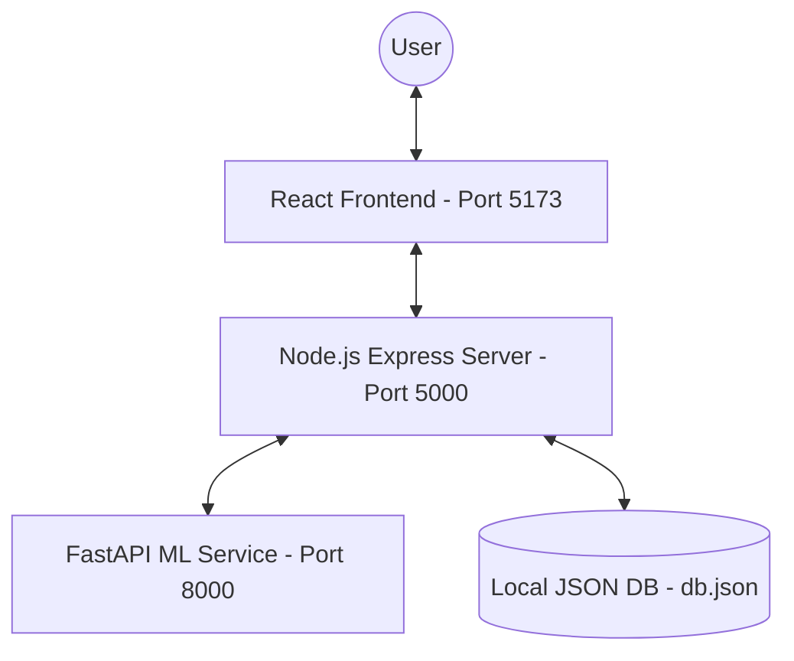

# Project Report: Early Detection of Personal Financial Leakage (PFM AI)

## 1. Project Overview
**PFM AI** is a professional full-stack application designed to identify "financial leakage"—unusual spending, dormant subscriptions, and anomalous transactions—using localized Machine Learning models. The system provides a SaaS-like experience for personal financial security.

---

## 2. System Architecture
The application follows a modular, decoupled architecture consisting of three primary services:

---

## 3. Technical Specification

### 3.1 Frontend (pfm-client)
A modern, responsive dashboard built for performance and professional aesthetics.
- **Framework:** React 18 (Vite)
- **Styling:** Tailwind CSS (Custom SaaS UI tokens, Glassmorphism)
- **Charts:** Recharts (Area, Bar, and Pie distributions)
- **Icons:** Lucide React
- **Routing:** React Router DOM v6
- **State Management:** React Context API (Auth & Global State)

### 3.2 Backend (pfm-server)
An Express-based REST API handling authentication, transaction logging, and ML orchestration.
- **Language:** Node.js
- **Framework:** Express.js
- **Security:** JWT (JSON Web Tokens), Bcrypt.js (Password Hashing)
- **File Handling:** Multer (for CSV imports)
- **CORS:** Configured for cross-origin local development

### 3.3 Database (`db.json`)
For simplicity and zero-configuration local portability, the system uses a persistent JSON-based storage layer.
- **Persistence:** Local file system sync on every write.
- **Schema:**
  - `users`: `{ _id, name, email, password }`
  - `transactions`: `{ _id, user, amount, category, date, prediction, riskScore, confidenceScore }`

### 3.4 ML Service (ml-service)
A high-performance Python-based inference engine.
- **Framework:** FastAPI
- **Data Analysis:** Pandas, Numpy
- **ML Models:** 
  - `Scikit-Learn`
  - **Isolation Forest:** Primary unsupervised anomaly detection.
  - **Random Forest:** Secondary probability-based risk classifier.
- **Standardization:** `StandardScaler` & `LabelEncoder`.

---

## 4. ML Logic & Risk Assessment

### Dual-Layer Detection Layer
To ensure 100% reliability, the system employs a **Layered Logic** approach:

1. **Heuristic Model (Node.js):** 
   - Flags absolute outliers instantly (e.g., Transactions > $500).
   - Serves as a fallback if the Python service is offline.
2. **Probabilistic AI (Python):** 
   - Dynamically learns user patterns from uploaded CVS history.
   - Calculates a risk score (0-100%) based on isolation scores.

### Classification Matrix
- **0 - 50%:** **Normal** (Standard behavior)
- **51 - 100%:** **Risky** (Potential leakage / anomalous spike)

---

## 5. Security & Privacy
- **Stateless Auth:** All requests to the backend are protected by Bearer tokens.
- **Sensitive Data:** Transaction data is evaluated by the AI but never sold or exported to external third-party cloud analytics.
- **Encryption:** Passwords are never stored in plain text; Bcrypt salts and hashes all credentials.

---

## 6. Implementation Roadmap
- [x] **Phase 1:** Core Authentication & Dashboard.
- [x] **Phase 2:** Integration of FastAPI ML Service.
- [x] **Phase 3:** Full UI/UX Overhaul (SaaS Style).
- [x] **Phase 4:** Heuristic Fallback & Dual-Layer Logic.
- [x] **Current State:** Fully functional, localized deployment ready.

---
> [!NOTE]
> This documentation is generated dynamically based on the current implementation state of the PFM AI Project as of Apr 2026.
